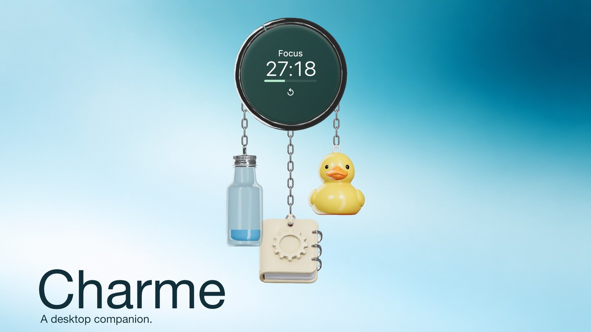

# Charme

A small collection of useful objects that lives on your desktop.

[**Try the browser preview**](https://stang-715.github.io/Charme/) · [**Installation status**](https://stang-715.github.io/Charme/installation.html) · [Collector Studio](https://stang-715.github.io/Charme/app.html?view=studio-proof)



Charme is a local-first floating desktop keychain for focus, water and everyday notes. The macOS build is an **unsigned development preview for Apple Silicon**, not a release-approved application. The public browser demo uses isolated temporary data and resets on reload.

## The objects

- **Focus:** 45-minute focus and 15-minute rest phases. Click the digits to pause or resume in the native app. Manual pause stays paused; sleep and lock block progress.
- **Water:** click the bottle to log the selected amount. The default 350 mL serving is one fifth of the 1.75 L target. Visual fill caps at full; totals preserve overshoot. Undo is available for 30 seconds.
- **Notebook:** open the unified Tasks, Notes, Charms and Settings hub.
- **Collection:** bottle and notebook are fixed. Five optional positions accept bundled decorations, name tags or validated user GLBs. Seven hanging charms maximum.

Collector Studio distinguishes **preview**, **assignment**, and **Apply**. Clicking a card never silently removes a charm. Importing a model adds it to the library; applying an arrangement adds it to the widget.

## Browser versus native app

The widget demo supports water logging, Undo, size changes and a gentle gust. Collector Studio supports model preview and temporary arrangement edits. Native window controls, the timer service, durable notes and persistent imports require the macOS app. Browser demos never connect to personal desktop data.

## Run from source

Requires Node.js 22.12+ and npm. macOS Apple Silicon is the initial target.

```sh
git clone https://github.com/Stang-715/Charme.git
cd Charme
npm ci
npm test
npm start
```

```sh
npm run build     # TypeScript, renderer and Electron bundles
npm run package   # unpacked unsigned macOS app
npm run dist      # unsigned DMG and ZIP
```

No verified installer download is advertised until native launch and distribution gates pass. See [installation status](https://stang-715.github.io/Charme/installation.html).

## Updates and recovery

Export a `.charme` backup before updating. Quit the older app from its tray, then open the new build and verify its build identifier in Settings. Keep the data folder intact; older builds refuse unsupported newer schemas.

Use **Data folder** in the app to locate the real storage directory. Development storage is usually under `~/Library/Application Support/charme`. JSON is not encrypted. State, session checkpoints and validated recovery backups are stored locally. Managed GLBs live outside regular snapshots. Reset-all removes managed data and backups; user-created exports elsewhere remain untouched.

The authenticated localhost dashboard works while Charme runs. Reopen it from the tray after restarting the app. It is not a cloud account or a cross-device synchronization service.

## Imports and assets

Static self-contained GLB 2.0 with embedded PNG/JPEG textures is supported. Imported skins, morph targets, external resources and unsupported compression are rejected. Initial limits: 20 MB per file, 200,000 triangles, 100 primitives, 512 nodes, 4096-pixel textures and 96 MiB estimated texture memory per asset. Combined active import and library budgets are enforced.

All replacement model geometry comes through Magnific; uploaded GLBs are user supplied. Code transforms, shades and animates the geometry. Provenance is recorded in `public/models/manifest.json` and `assets/`. Public asset redistribution review remains outstanding; availability in a demo does not establish clearance for downstream reuse.

## Verification and limitations

Read [Collector Studio evidence and remaining gates](docs/COLLECTOR_STUDIO_BETA.md) and [editorial showcase verification](docs/EDITORIAL_SHOWCASE.md). Browser observations and automated checks do not establish native VoiceOver, click-through, sleep/lock, monitor-change or sustained performance acceptance.

The public showcase uses real scene/component captures with fictional state. It does not present AI campaign artwork as actual application behavior.

## Blue editorial edition

[Watch the 24-second film](https://stang-715.github.io/Charme/#film) · [Presentation PDF](https://stang-715.github.io/Charme/editorial/downloads/Charme-presentation.pdf) · [Editable PPTX](https://stang-715.github.io/Charme/editorial/downloads/Charme-presentation.pptx)

Soft blue gradients, white object studies and a landscape desktop mockup. The film uses the existing Magnific models with connected-chain motion; its motion is art-directed, not a recording of live app physics. HDR-style lighting is delivered in standard SDR.
